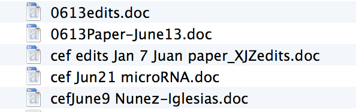

# Git and GitHub

## What is Git and why do you want it?

Git is a _revision control management system_[^git][^gitbook]. It helps you
keep track of changes to your files. You've probably had the following thing
happen to you before:

Your authors certainly have:

Notice:

- Different versions of the same document have different filenames.
- The date and author of a change are encoded haphazardly in the filename.
- Serial edits by different authors are concatenated in the filename, with no
  indication as to whose edit came first.
- These are just five files in one directory; other revisions are probably
  scattered around my various hard drives and as email attachments.

This is known as _revision hell_, and it happens when you don't use _revision
control_ (the technical term for the category of software git belongs to), even
if you are working alone. Revision control is like a *time machine* for your
files.

There are (at least) three stages of git enlightenment:

1. Maintain a linear history for a file or group of files.
2. Use branches effectively to group related changes together, as well as
   maintain parallel versions.
3. Use branches and pull-requests to collaborate effectively.

It can take a long time to pass all three, and we hope this section will help
you get there faster.

A thing to keep in mind while you're learning: time travel is *hard*, and git
is harder, because it combines time travel and parallel timelines with, shall
we say, a not-amazing user experience. Although changes to git in recent years
have improved this last point, almost everyone often finds themselves searching
for just that right git command on the internet.

Now, after reading that, you might wonder, "why would anyone want to learn
this?"

The answer is that time travel is an incredible superpower. Once you are
comfortable with git (and your new powers), you will be much more fearless in
your programming. This lack of fear lets you try out different things quickly,
and the resulting rapid feedback is key to improving your skills in scientific
programming.

This doesn't even take into account the benefits of collaborating with fellow
time travellers, which, as you'll see in {doc}`github`, is essentially life
changing.

## References

[^git]: http://git-scm.com/ The Git homepage. A plethora of resources.

[^gitbook]: http://git-scm.com/book The Git book. Your starting point for all
    git knowledge.
